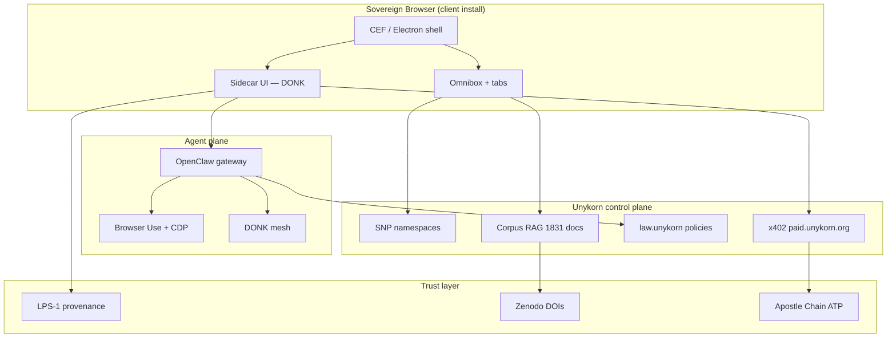

# Digital Giant Browser

[](docs/CHROMIUM_BUILD_PLAN.md)
[](docs/CHROMIUM_BUILD_PLAN.md)
[](docs/modules/WALLET_MODULE.md)
[](docs/modules/AGENT_MODULE.md)

**A managed, white-label Chromium-based browser for Digital Giant clients.** Tabs, omnibox, profiles — plus an integrated DG Wallet (BIP-39 native + EIP-1193 bridge), x402 payment rails, an agent module that runs entirely on a local LLM, and enterprise policy controls. Built as a real desktop binary, not a web app.

**Authoritative plan:** [docs/CHROMIUM_BUILD_PLAN.md](docs/CHROMIUM_BUILD_PLAN.md)
**Product home:** [digitalgiant.xyz](https://digitalgiant.xyz) · **Entity:** FTH Trading / Unykorn Labs

---

## Table of contents

### 🟣 Product

| Document | Description |
|----------|-------------|
| [docs/00-TABLE-OF-CONTENTS.md](docs/00-TABLE-OF-CONTENTS.md) | Color-coded full index |
| [docs/01-PRODUCT-CANON.md](docs/01-PRODUCT-CANON.md) | Source of truth — what we ship |
| [BUSINESS_GOALS.md](BUSINESS_GOALS.md) | Revenue tiers, FTH 4-layer stack |
| [REQUIREMENTS.md](REQUIREMENTS.md) | FR / NFR / SEC / CMP requirements |

### Engineering

| Document | Package |
|----------|---------|
| [docs/CHROMIUM_BUILD_PLAN.md](docs/CHROMIUM_BUILD_PLAN.md) | **Authoritative build plan** — engine choice, milestones, costs, code-signing, white-label pipeline |
| [docs/modules/BROWSER_MODULE.md](docs/modules/BROWSER_MODULE.md) | `packages/shell-cef` · native window contract |
| [docs/modules/WALLET_MODULE.md](docs/modules/WALLET_MODULE.md) | `packages/dg-wallet` · dual identity layer |
| [docs/modules/AGENT_MODULE.md](docs/modules/AGENT_MODULE.md) | `packages/agent-bridge` + `packages/agent-shell-bridge` · sovereign agent + IPC |
| [docs/02-ENGINE-DECISION.md](docs/02-ENGINE-DECISION.md) | Historical CEF vs Electron decision — superseded by CHROMIUM_BUILD_PLAN.md |
| [docs/08-ROADMAP.md](docs/08-ROADMAP.md) | M1–M4 timeline |
| [packages/shell-cef/](packages/shell-cef/) | Primary browser shell |
| [packages/shell-electron/](packages/shell-electron/) | Fallback spike |
| [packages/sidecar-ui/](packages/sidecar-ui/) | React agent side panel |
| [packages/agent-bridge/](packages/agent-bridge/) | OpenClaw + Browser Use |
| [packages/extension/](packages/extension/) | ⚠️ Dev prototype only |

### 🟢 UX & GTM

| Document | Description |
|----------|-------------|
| [docs/03-UX-VISION.md](docs/03-UX-VISION.md) | Three-screen story, private search |
| [docs/04-COMET-BENCHMARK.md](docs/04-COMET-BENCHMARK.md) | Comet competitive benchmark |
| [docs/05-GTM-CLIENT.md](docs/05-GTM-CLIENT.md) | Client tiers, sales motion |

### 🔴 Legal & Security

| Document | Description |
|----------|-------------|
| [TRADEMARKS.md](TRADEMARKS.md) | Sovereign Browser™, Unykorn®, SNP™, LPS-1™, DONK™ |
| [LEGAL_PROTECTIONS.md](LEGAL_PROTECTIONS.md) | IP, SLA framework, export awareness |
| [docs/06-SECURITY.md](docs/06-SECURITY.md) | Approval gates, Zenity lessons |
| [docs/07-COMPLIANCE-CITES.md](docs/07-COMPLIANCE-CITES.md) | Zenodo DOIs, Basel/ISO awareness |
| [LICENSE](LICENSE) | BSL 1.1 + commercial terms |
| [CONTRIBUTING.md](CONTRIBUTING.md) | Contribution guidelines |

---

## Architecture



**Control plane:** ~170 FTHTrading repos · 151 operator sites · OpenClaw agent fleet · Cloudflare edge (hail/law/x402).

**Not the browser:** [storm.unykorn.org](https://storm.unykorn.org) is Storm Ops HUD — operator deck only.

---

## Quick start (developers)

### Prerequisites

- Windows 11 or macOS 14+
- OpenClaw gateway on `http://127.0.0.1:18789` (operator stack)
- Chromium-based browser for extension dev prototype

### 1. Clone

```powershell
git clone https://github.com/FTHTrading/browser.git
cd browser
```

### 2. Extension dev prototype (not ship path)

```powershell
# Verify gateway
curl http://127.0.0.1:18789/health

# Chrome → chrome://extensions → Load unpacked → packages/extension/
```

Edit `packages/extension/config.js` for your local gateway URL.

### 3. Next engineering (M1)

See [docs/08-ROADMAP.md](docs/08-ROADMAP.md) — start **CEF spike** in `packages/shell-cef/`.

---

## Monetization tiers

| Tier | Price | Buyer |
|------|-------|-------|
| **Creator Studio** | $49–149/mo | Authors, creators |
| **Business** | $499–2k/mo | Web3 teams, agencies (white-label) |
| **Enterprise** | Custom | Regulated / air-gapped |

Plus x402 action fees · namespace fees · marketplace rev share. Details: [BUSINESS_GOALS.md](BUSINESS_GOALS.md).

---

## Research citations

| DOI | Subject |
|-----|---------|
| [10.5281/zenodo.18646886](https://doi.org/10.5281/zenodo.18646886) | LPS-1 literary provenance |
| [10.5281/zenodo.18729652](https://doi.org/10.5281/zenodo.18729652) | Genesis Protocol proof index |

Corpus: **2,998 harvested · 1,831 manifest** documents for local RAG.

---

## Repo structure

```
browser/
├── README.md                 # This file
├── LICENSE                   # BSL 1.1
├── TRADEMARKS.md
├── BUSINESS_GOALS.md
├── LEGAL_PROTECTIONS.md
├── REQUIREMENTS.md
├── docs/                     # Canon + engineering docs
├── packages/
│   ├── shell-cef/            # Primary engine (M1)
│   ├── shell-electron/       # Fallback
│   ├── sidecar-ui/           # React side panel
│   ├── agent-bridge/         # OpenClaw + Browser Use
│   └── extension/            # Dev prototype ONLY
└── .github/                  # Issue + PR templates
```

---

## License

Source code: [Business Source License 1.1](LICENSE) — production and white-label require [commercial license](LICENSE#commercial-licensing).

Third-party components (Chromium, CEF, etc.) retain their original licenses.

---

<p align="center">
  <sub>
    Sovereign Browser™ · Unykorn® · DONK™ · SNP™ · LPS-1™<br>
    Copyright © 2026 FTH Trading. Chromium® is a trademark of Google LLC.<br>
    This product is not Google Chrome.
  </sub>
</p>
