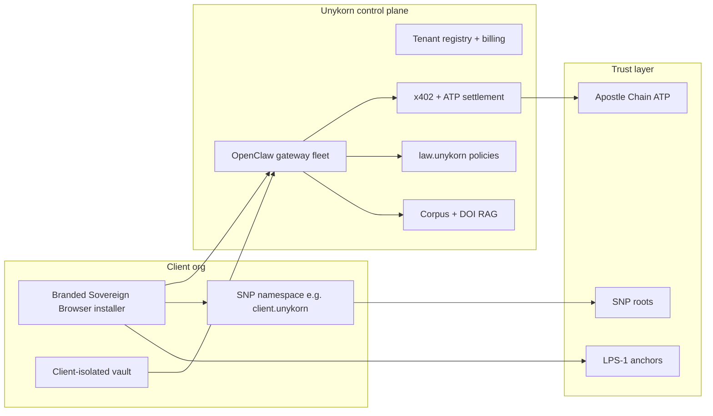

# Sovereign Browser — Product Canon (Source of Truth)

**Document version:** 1.0 (canonical)  
**Date:** 2026-05-24  
**Status:** **AUTHORITATIVE** — supersedes extension-first / Storm Browser product naming  
**Repo:** [github.com/FTHTrading/browser](https://github.com/FTHTrading/browser)  
**Commercial product name:** **Sovereign Browser**

---

## Canonical correction (read first)

| Topic | **Wrong (prior docs)** | **Correct (this canon)** |
|-------|------------------------|---------------------------|
| Product | "Storm Browser" = the browser product | **Sovereign Browser** = installable browser product sold to clients |
| `storm.unykorn.org` | Same as browser | **Storm Ops HUD** — JARVIS 2D ops deck; **not** the browser |
| MVP shape | Chrome extension + Tauri later | **Full browser shell** (CEF/Electron → Chromium fork path); extension = **dev prototype only** |
| GTM | One site / operator tool | **Multi-tenant platform**: white-label installs + Unykorn control plane |
| Name collision | Storm Browser pairs with storm.unykorn | **Intentional split:** Storm = ops; Sovereign = user-facing browser |

Historical docs remain for audit trail. When they conflict, **this file wins**.

**Related:** [02-ENGINE-DECISION.md](./02-ENGINE-DECISION.md) · [05-GTM-CLIENT.md](./05-GTM-CLIENT.md) · [08-ROADMAP.md](./08-ROADMAP.md)

---

## What this product IS

**Sovereign Browser** is a **standalone, installable, multi-platform web browser** (Windows/macOS first; mobile WebView shell in Phase 3) that competes with Chrome, Brave, Arc, and Perplexity Comet on **agentic browsing** — not as a better extension or a single ops website.

It is the **client-deliverable surface** for Unykorn's full stack:

| Layer | Unykorn assets |
|-------|----------------|
| **Identity** | SNP (Sovereign Namespace Protocol), wallet, namespace omnibox |
| **Agents** | OpenClaw gateway, DONK mesh, Browser Use / Playwright tool plane |
| **Payments** | x402 facilitator (`paid.unykorn.org`), Apostle Chain ATP |
| **Creator / proof** | Donkeys / XXXIII, LPS-1 provenance, Zenodo DOI corpus (2,998 harvest / 1,831 manifest) |
| **Compliance** | `law.unykorn` policy routing, Basel/ISO packs |
| **Knowledge** | CORPUS_MANIFEST RAG, Genesis/RAMM research |
| **Voice** | Nerve (voice-first delegation) |
| **Simulation** | Genesis Protocol (deterministic agent scenarios — enterprise) |
| **Edge** | Cloudflare Workers (hail-storm-law router, x402 gateway) |

**~170 repos** and operator systems compose the **control plane**; the browser is how **end users and paying clients** experience them.

---

## What this product IS NOT

- **Not** `storm.unykorn.org` (ops HUD, swarm map, gateway links)
- **Not** a Chrome extension as the shipped product (`packages/extension/` — **prototype only**)
- **Not** a Perplexity Comet clone (closed cloud agent + subscription-only)
- **Not** Electron-as-final-state without a real browser chrome and update channel (Electron is **Phase 1 shell**, not the 365d end state)

---

## Product name decision

| Candidate | Verdict |
|-----------|---------|
| **Sovereign Browser** | **Selected** — sellable, SNP-aligned, white-label friendly ("Powered by Sovereign") |
| Unykorn Browser | Strong house brand; use as "Unykorn Sovereign Browser" in enterprise contracts |
| Hail Browser | Rejected — collides with `hail.unykorn` edge router |
| XXXIII Browser | Rejected for **platform** — reserve for Donkeys literary SKU |
| Storm Browser | **Retired for product** — reserve for ops subdomain family only |

---

## Client platform architecture (multi-tenant)

### Tiers (sellable)

| Tier | Buyer | Deliverable |
|------|-------|-------------|
| **Creator Studio** | Content creators, authors | Namespace + agent + LPS-1 provenance + monetization (x402 skills) |
| **Business** | Web3 teams, agencies | Team agents, compliance packs, x402 billing dashboard |
| **Enterprise** | Regulated / air-gapped | Private L1 hooks, on-prem gateway, custom SNP root, no cloud corpus egress |

**White-label:** `creator.clientbrand.com` or SNP `client.unykorn` + signed installer channel (MSIX/pkg/dmg).

**Revenue:** subscription (tier) + x402 action fees + namespace fees + marketplace cut on agent skills.

---

## Differentiators (vs Comet / Chrome / Brave)

1. **Sovereign namespace omnibox** — resolve SNP manifests, skills, and policy before navigation
2. **LPS-1 content provenance** — paragraph-level verify on any page/creator workflow
3. **Multi-agent delegation** — OpenClaw mesh (planner / executor / compliance) native in shell
4. **x402 micropayments** — privileged actions settle with receipts in-browser
5. **DOI / research corpus RAG** — 1,831+ manifest docs; citation cards on agent replies
6. **Voice-first (Nerve)** — push-to-talk delegation without URL typing
7. **Creator agent marketplace** — namespace-published skills with revenue share
8. **Compliance routing** — `law.unykorn` gates by jurisdiction/product
9. **AR/VR WebXR** — hail/storm/law scenes as spatial approve layers (Phase 3+)
10. **Never-shutdown mesh sync** — operator queue + client vault sync via OpenClaw
11. **Client-isolated vaults** — tenant crypto + corpus boundaries
12. **Genesis-backed simulations** — enterprise what-if before autonomous purchase flows

---

## First engineering milestone

**M1 — "Sovereign Shell Alpha" (90 days)**

- Signed **Windows + macOS** installer branded Sovereign Browser
- Engine: **CEF stable branch** (or Electron 33+ fallback)
- UI: Omnibox + **agent side panel** (not extension-dependent)
- Backend: OpenClaw gateway on `127.0.0.1:18789` + optional tenant cloud relay
- Automation: Browser Use sidecar over CDP
- Gates: Approval modal + x402 on pay/submit/download

Success: 10 internal workflows, 0 unapproved payments, p95 plan→first action < 8s local.

---

*Last updated: 2026-05-24 · Sovereign Browser™ · Unykorn®*
