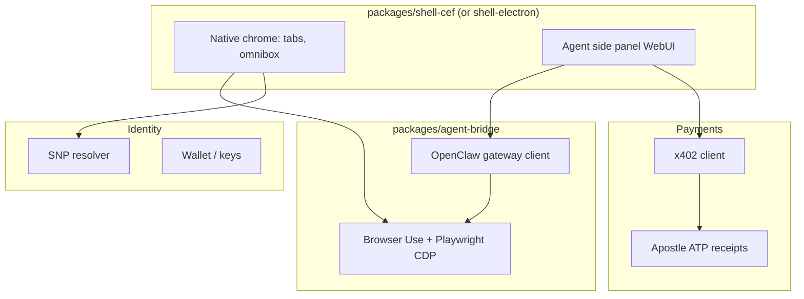

# Sovereign Browser — Engine & Stack Decision Record

**Document version:** 1.0  
**Date:** 2026-05-24  
**Status:** **DECIDED for v1** (subject to 90d spike validation)  
**Parent canon:** [01-PRODUCT-CANON.md](./01-PRODUCT-CANON.md)

---

## Executive answers

| Question | Answer |
|----------|--------|
| **Can we use Chromium?** | **Yes.** BSD-3-Clause (+ LGPL/MPL components). Ship branded browser with license notices; no Google Chrome trademarks. |
| **Can we sell commercially?** | **Yes** — white-label is standard (Brave, Edge, Opera model). |
| **v1 primary stack** | **CEF** host app + **OpenClaw** + **Browser Use** (MIT) |
| **v1 fallback** | **Electron** custom shell if CEF build slips 30d |
| **365d target** | Chromium fork with `unykorn/` patch layer (Brave-style) |

---

## OSS engine comparison

| Option | License | v1 ship | Notes |
|--------|---------|---------|-------|
| **CEF** | BSD | **Primary v1** | Production APIs; `about:license` |
| **Electron** | MIT | **Fallback v1** | Fast spike; not 365d end state |
| **Chromium fork** | BSD-3 | Phase 4 | Dedicated engineer required |
| **Chrome extension (MV3)** | N/A | **Dev only** | Not sellable as browser |
| **Firefox / Ladybird** | MPL/BSD | No | CDP/agent ecosystem mismatch |

Sources: [Chromium branded builds](https://chromium.googlesource.com/chromium/src/+/HEAD/docs/google_chrome_branded_builds.md), [CEF general usage](https://chromiumembedded.github.io/cef/general_usage.html).

---

## Recommended v1 stack

| Layer | Pick | Package |
|-------|------|---------|
| **Engine** | CEF stable LTS | `packages/shell-cef/` |
| **Fallback** | Electron 33+ | `packages/shell-electron/` |
| **Agent** | OpenClaw + Browser Use | `packages/agent-bridge/` |
| **Side panel UI** | React WebUI | `packages/sidecar-ui/` |
| **Dev prototype** | Chrome MV3 | `packages/extension/` (not ship path) |

**Avoid in core binary:** Skyvern (AGPL) unless legally isolated as optional cloud service.

---

## Phase alignment

| Phase | Engine decision |
|-------|-----------------|
| **1 (90d)** | CEF host + side panel; extension unmaintained for demos |
| **2 (180d)** | SNP omnibox in native chrome; x402 wallet module |
| **3 (365d)** | CI white-label pipeline (per-tenant branding) |
| **4** | Upstream Chromium fork `unykorn/chromium` patch branch |

---

## Spike acceptance criteria (week 2–4)

- [ ] CEF binary loads `https://donkeys.xxxiii.io` and standard HTTPS sites
- [ ] CDP port exposed for Browser Use
- [ ] Side panel WebUI talks to OpenClaw gateway
- [ ] Signed dev build installs on Win11 + macOS 14+
- [ ] License page lists Chromium/CEF notices

If CEF spike fails: pivot to Electron shell with same agent wiring; **do not** pivot to extension-only.

---

*Last updated: 2026-05-24*
