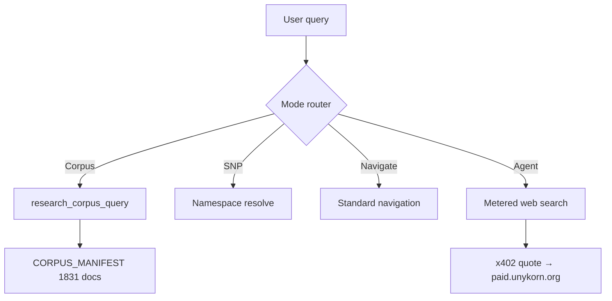

# Sovereign Browser — UX & Search Vision

**Document version:** 1.0  
**Date:** 2026-05-24  
**Status:** Recommended direction for M1–M2  
**Inputs:** [04-COMET-BENCHMARK.md](./04-COMET-BENCHMARK.md) · [01-PRODUCT-CANON.md](./01-PRODUCT-CANON.md)

---

## Product intent

Build the browser that **feels as effortless as Comet** but **behaves like a sovereign control plane**: your corpus, your namespace, your receipts. Beauty is **trust density** — citations, policy badges, step traces, ATP costs visible before action.

**Product home:** [unykorn.ai](https://unykorn.ai) — same experience as Sovereign Browser new tab.

---

## Three-screen story

### Screen 1 — New tab (`unykorn.ai` / `unykorn://newtab`)

- Centered search: *Search your corpus, web, or namespace…*
- Mode pills: **Corpus · Web · SNP · Agent**
- Recent corpus hits + money lanes (SNP, x402, Donkeys, RAMM, Creators)
- Install CTA hidden when running native shell

### Screen 2 — Browse (minimal chrome)

- Receded chrome — full viewport for content
- DONK button opens Sidecar without navigation
- Tab hover → one-line AI preview (Comet pattern)
- SNP-protected pages show **policy badge** in omnibox

### Screen 3 — Side panel (DONK + specialists)

- 360px right rail; step trace always visible during agent runs
- `@tab` syntax for multi-source research
- x402 approval inline before web search / submit / download
- Voice via Nerve — push-to-hold

---

## Private search architecture

### Search tiers (default order)

1. **Corpus** — Local RAG (1,831 manifest; 2,998 harvest). DOI citation cards.
2. **Namespace** — SNP manifest / skill / policy lookup.
3. **Navigate** — URL detection.
4. **Web (agent)** — Opt-in; x402 metered; receipts in-browser.

### Omnibox modes

| Signal | Mode | Example |
|--------|------|---------|
| Default text | Corpus → suggest web | `genesis protocol deterministic` |
| URL pattern | Navigate | `https://donkeys.xxxiii.io` |
| `snp:` / `*.unykorn` | SNP resolve | `snp:kevan.unykorn/skills/research` |
| `/agent` or "do …" | Agent command | `/agent summarize open tabs and cite DOIs` |

---

## Better than Comet — checklist

| # | Item | Acceptance |
|---|------|------------|
| 1 | Corpus-first search | Default before any cloud |
| 2 | Sub-200ms local hits | No spinner for corpus |
| 3 | DOI citation cards | Zenodo + local path |
| 4 | SNP omnibox | Resolve manifests in chrome |
| 5 | x402 transparent pricing | ATP cost before action |
| 6 | Policy gates | law.unykorn + approval modals |
| 7 | No hidden extensions | Auditable capabilities |
| 8 | Local gateway option | OpenClaw on LAN |
| 9 | Multi-agent delegation | Planner/executor/compliance visible |
| 10 | Creator monetization | Namespace skills + LPS-1 |

---

## Design system tokens (v1)

| Token | Value |
|-------|-------|
| `--bg` | `#0a0e14` |
| `--surface` | `#111820` |
| `--accent` | `#38bdf8` |
| `--ok` | `#22c55e` |
| Sidecar width | 360px |
| Font | Segoe UI, system-ui; Cascadia for mono |

**Formula:** Comet Sidecar layout + Nerve dark claw + DONK personality.

---

## M1 UX scope

**In scope (90d):** New tab search, minimal chrome, side panel → OpenClaw, step trace, @tab refs, download page on unykorn.ai

**Out of scope M1:** Full SNP omnibox, x402 wallet UI (stub OK), tab hover previews, split view, voice, white-label theming

---

## Success metrics (UX)

| Metric | Target M1 |
|--------|-----------|
| Corpus search p95 | <200ms local |
| Sidecar → gateway connected | <2s |
| Search corpus → open doc → ask DONK | 3 clicks |
| Unapproved privileged actions | 0 |

---

*Last updated: 2026-05-24*
